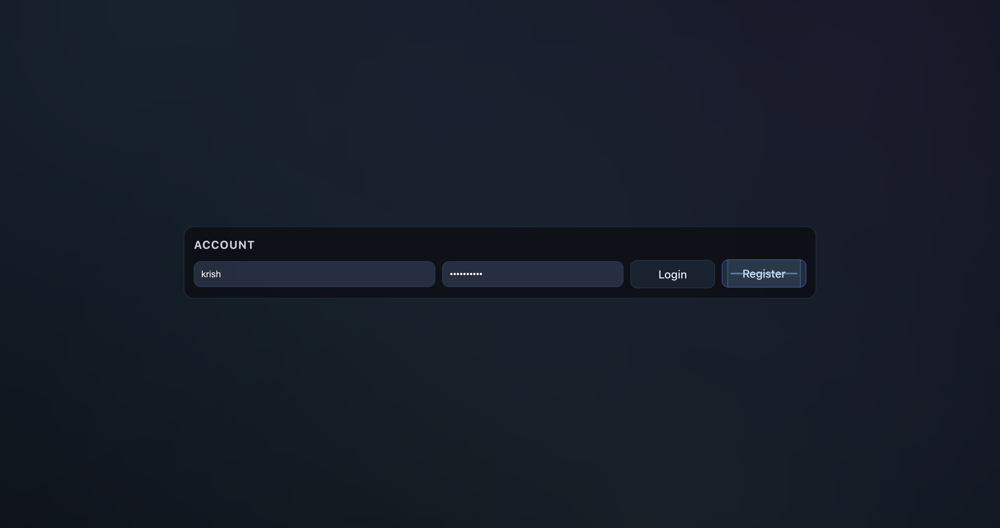
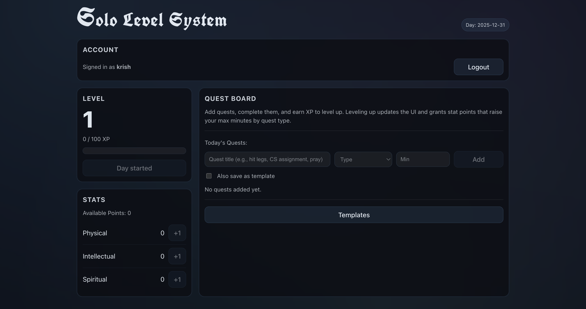
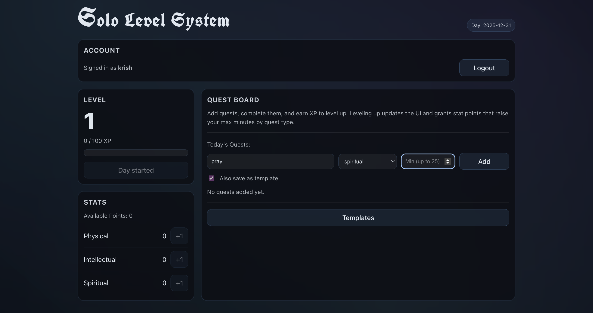
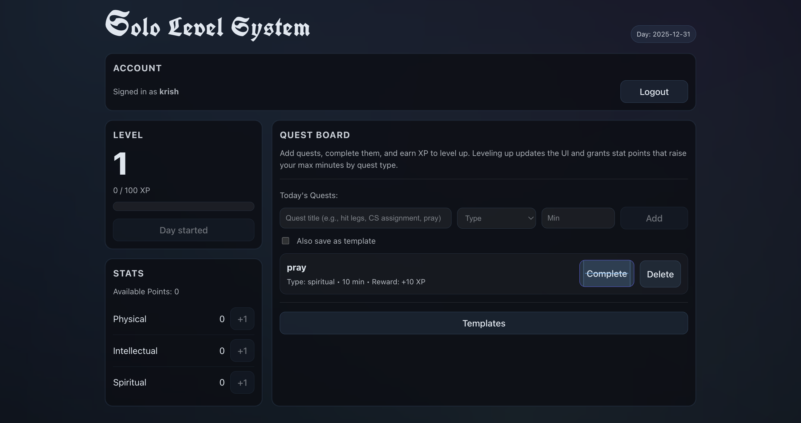
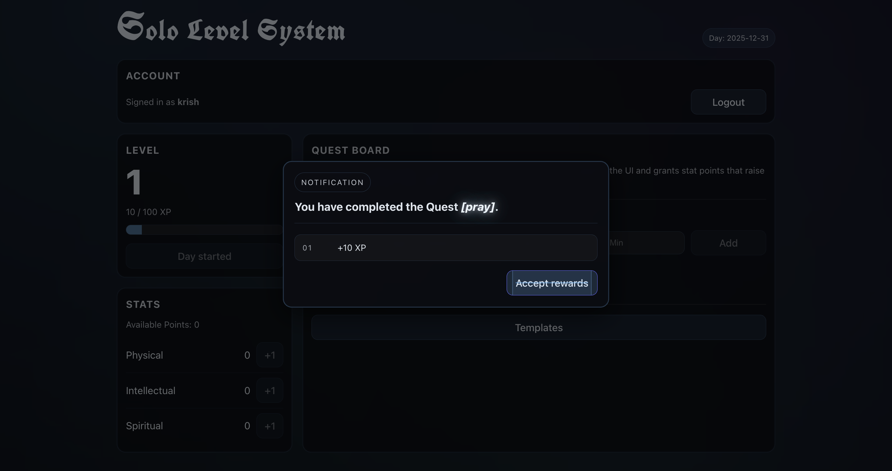
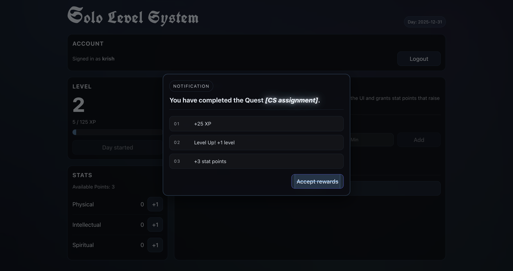
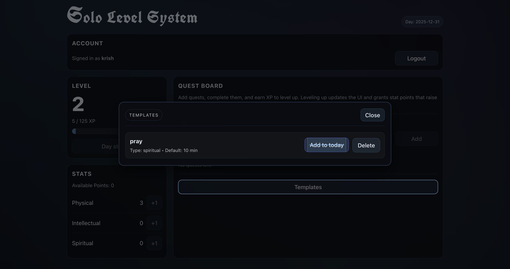
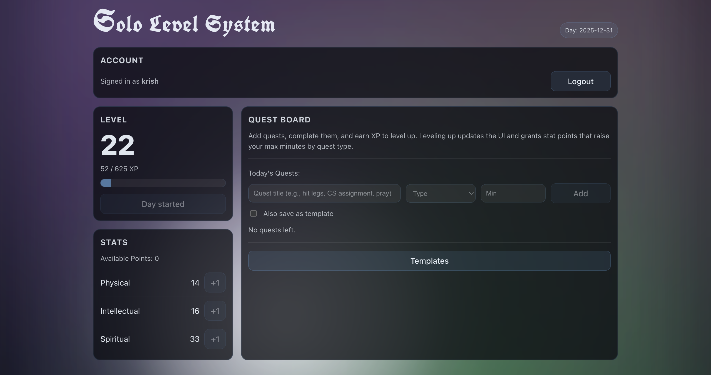
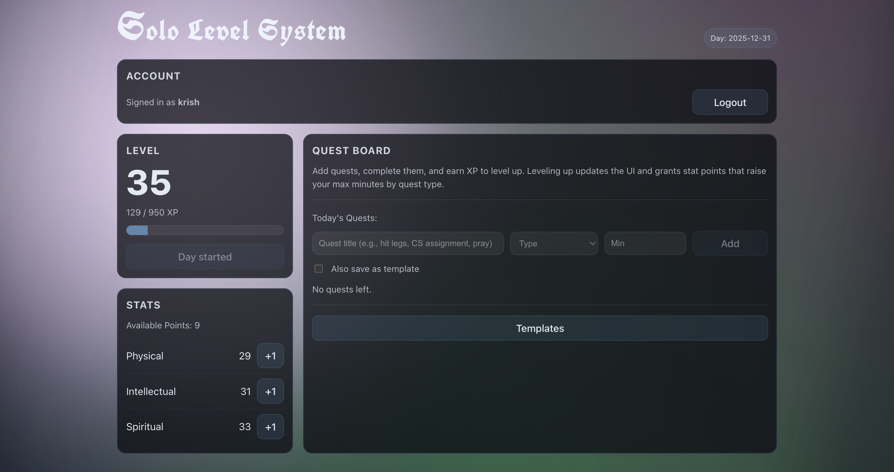

# Solo Level System ⚔️  
**A Daily Productivity Tracker Inspired by the *System* from [Solo Leveling](https://en.wikipedia.org/wiki/Solo_Leveling)**

---

## Overview
Solo Level System is a full-stack web application that turns daily work and habits into a progression-based system. Users start each day, complete quests across different categories, earn experience points, level up, and allocate stat points that directly affect how the system behaves.

Rather than tracking productivity passively, the app frames each day as an active run, where consistency and effort are rewarded through visible growth and evolving UI feedback.

The project was built end-to-end, including authentication, persistence, progression logic, and deployment.

---

## Quick Note
- The backend may take a few seconds to respond on the first request due to cold starts on the hosting provider. After the initial wake-up, logins and API calls should feel normal.

---

## Core Concept
The system is built around a few core ideas:

- Each day is a self-contained session  
- Tasks are framed as quests  
- Completing quests grants XP  
- XP leads to level ups  
- Level ups grant stat points  
- Stats influence how demanding future quests can be  

Progression is not only numerical. As users level up, the interface itself becomes more dynamic, reinforcing the feeling of growth over time.

---

## Authentication & Accounts 🔐
Users create accounts using a username and password. Authentication is handled using JSON Web Tokens (JWT) and persists across sessions.

**Auth form (Login + Register)**  


Each account maintains its own progression data, templates, and daily history stored in MongoDB.

---

## Daily System 🗓️
Before any quests can be added, the user must explicitly start their day.

**Day not started**  


**Day started (active dashboard)**  


- A day can only be started once  
- Quests are scoped to a single day  
- At midnight (Toronto time), the system automatically rolls over  
- Previous quests are cleared and a new day must be started  

This structure enforces intentional daily planning rather than passive task accumulation.

---

## Core Dashboard: Quests, XP & Stats 🎯📈
Once the day is active, the dashboard becomes fully interactive. Quest creation, XP tracking, and stat visibility all live within a single unified interface.

**Core dashboard (entering a quest + save as template option)**  


- Quests are created with a title, category, and duration  
- Quests can optionally be saved as templates  
- XP progress is always visible  
- Stat totals are visible at all times  

**Quest added to active list**  


This unified layout keeps planning, execution, and progression tightly connected.

---

## Quest Completion Feedback ✅
Completing a quest produces immediate system feedback summarizing the outcome.

**Quest completion (no level-up)**  


**Quest completion (with level-up)**  


Feedback includes:
- XP gained from the quest  
- Any level-ups triggered  
- Updated stat point totals when applicable  

This instant response ties effort directly to progression and reinforces consistent completion.

---

## Leveling & Stat Allocation 📈
XP fills a progress bar toward the next level. When a level is gained, stat points are awarded and can be allocated manually.

**Stat points and allocation panel**  


Stats directly affect gameplay:
- Higher stats increase the maximum allowable minutes for quests of that type  
- Growth unlocks higher effort ceilings rather than cosmetic-only rewards  

---

## Templates System 📋
Frequently repeated quests can be saved as templates to speed up daily setup.

**Templates panel**  


Templates:
- Persist across days  
- Allow quick quest creation with preset values  
- Reduce repetitive setup while keeping daily intent explicit  

---

## Level-Based UI Progression ✨
The interface evolves visually as the player levels up. Visual complexity is intentionally gated behind progression to mirror RPG-style power scaling.

### Low-Level UI (10+)


- Minimal visual effects  
- Clean, structured layout  
- Focus on clarity and system fundamentals  

### Mid-Level UI (20+)


- Subtle background motion  
- Increased visual depth  
- Interface begins to feel reactive  

### High-Level UI (30+)


- Dynamic background effects  
- Cursor-based lighting  
- Full visual feedback tied directly to progression    

---

## Tech Stack 🛠️

**Frontend**
- React  
- Vite  
- Custom CSS (no UI framework)

**Backend**
- Node.js  
- Express  
- MongoDB (Atlas)  
- JWT authentication  

**Deployment**
- Frontend: Vercel  
- Backend: Render  

---

## Repository Structure
```
solo-level-system/
│
├── client/                         # Frontend (Vite + React)
│ │
│ ├── public/                       # Static assets served directly
│ │ └── favicon.png                 # App favicon
│ │
│ ├── src/                          # Frontend source code
│ │ ├── App.jsx                     # Main application logic and state orchestration
│ │ ├── App.css                     # Global styles + level-based visual effects
│ │ ├── SystemModal.jsx             # System-style modal + notification overlays
│ │ ├── index.css                   # Base resets and shared styles
│ │ └── main.jsx                    # React entry point
│ │
│ ├── .gitignore                    # Client-specific ignores
│ ├── eslint.config.js              # ESLint configuration
│ ├── index.html                    # Vite HTML entry
│ ├── package.json                  # Frontend dependencies and scripts
│ ├── package-lock.json             # Frontend lockfile
│ ├── README.md                     # Frontend notes (if applicable)
│ └── vite.config.js                # Vite configuration
│
├── server/                         # Backend (Node + Express)
│ │
│ ├── middleware/                   # Request guards that run before routes
│ │ └── auth.js                     # JWT authentication middleware
│ │
│ ├── models/                       # MongoDB schemas (Mongoose models)
│ │ ├── Template.js                 # Quest template schema
│ │ └── User.js                     # User schema (auth, stats, quests, progression)
│ │
│ ├── index.js                      # Express server, routes, and system logic
│ ├── package.json                  # Backend dependencies and scripts
│ └── package-lock.json             # Backend lockfile
│
├── screenshots/                    # README screenshots (UI states & feature demos)
│ ├── auth.png                      # Login + register screen
│ ├── day-not-started.png           # Dashboard before starting a day
│ ├── day-started.png               # Dashboard after starting a day
│ ├── quest-create.png              # Entering a quest + save-as-template option
│ ├── quest-added.png               # Quest successfully added to the list
│ ├── quest-complete.png            # Quest completion feedback (no level-up)
│ ├── quest-complete-levelup.png    # Quest completion feedback with level-up
│ ├── stats.png                     # Stat points allocation panel
│ ├── templates.png                 # Templates panel
│ ├── ui-low-level.png              # Low-level UI visuals (10+)
│ ├── ui-mid-level.png              # Mid-level UI visuals (20+)
│ └── ui-high-level.png             # High-level UI visuals (30+)
│
├── .gitignore                      # Root ignores
└── README.md                       # Project documentation
```

---

## Environment & Deployment Notes
- All secrets are managed via environment variables  
- MongoDB credentials and JWT secrets are never committed  
- CORS is explicitly restricted to the production frontend domain  
- Vite environment variables are injected at build time  

---

## Notes
- The system is designed to scale with progression rather than reset daily effort limits  
- All validations (minutes, stats, XP) are enforced server-side  
- UI effects are tied directly to progression rather than user settings 
